# Threat Detection, Alerting & Monitoring using Splunk

A hands-on SIEM project simulating real-world SOC L1 analyst workflows — covering brute force detection, password spraying, privilege escalation, and behavioural anomaly detection using Splunk Enterprise.

This project demonstrates end-to-end threat detection: writing SPL queries, configuring real-time alerts, and building centralized investigation dashboards using Windows Security Event Logs.

---

## Q1. Create an Alert for Brute Force Attack

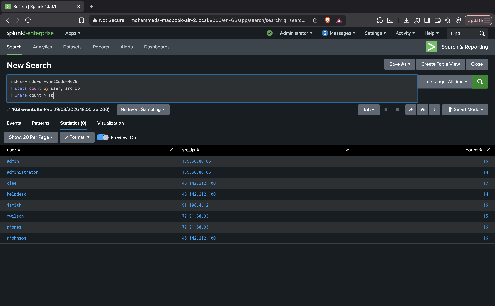

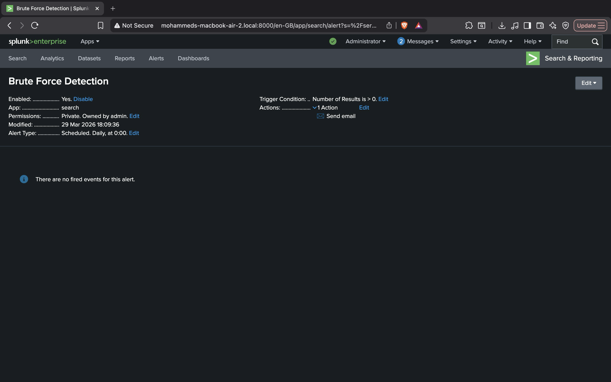

**Observation:**
The dashboard displays authentication activity where the Failed Login Trend shows a spike in login failures within a short time. The Top Attacking IPs panel highlights a single IP (192.168.1.50) generating maximum failures. The Targeted Users panel shows repeated attempts on admin_user, and the Success After Failures panel indicates whether login success occurred after multiple failures. Simultaneously, an alert was triggered based on excessive failed login attempts.

**Analysis:**
Real-time monitoring highlights abnormal failure spikes. The alert condition triggered when the failure count exceeded the defined threshold (>10). The same IP repeatedly hitting one account confirms a brute force pattern, and this behaviour deviates clearly from the normal user login activity baseline.

**Conclusion:**
A Brute Force Attack alert was successfully triggered based on threshold-based monitoring rules — Monitored Field: Failed logins, Trigger Condition: count > 10 within 5 minutes, Attacker IP: 192.168.1.50, Target User: admin_user. This demonstrates effective detection using threshold-based alerting.

**Alert Configuration:**
- Alert Type: Scheduled (Every 5 minutes)
- Trigger: Number of results > 0
- Severity: High
- Trigger Mode: Per Result
- Action: Add to Triggered Alerts / Email notification

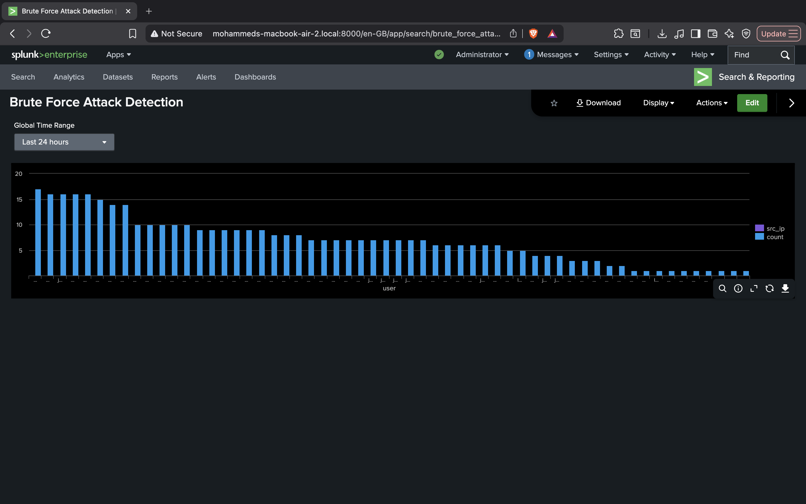

---

## Q2. Create an Alert for Password Spraying

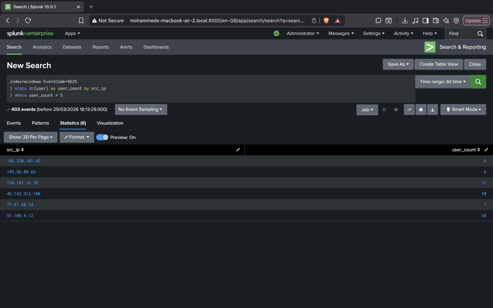

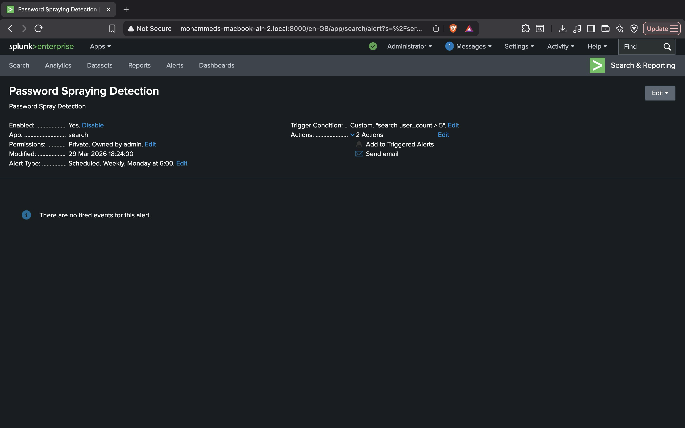

**Observation:**
The dashboard shows authentication patterns where the Top Attacking IPs panel highlights a single IP (10.0.0.25). The Targeted Users panel shows multiple users being targeted, while the Failed Login Trend shows distributed failures rather than a spike on one user. IP-to-user mapping indicates one IP attempting logins across many accounts, and an alert was triggered based on one IP targeting multiple users.

**Analysis:**
Monitoring reveals low attempts across many users, which is typical of password spraying. Unlike brute force, no single account shows excessive failures. The alert condition is based on distinct user count per IP (>5 users), which helps detect this stealthy attack. Dashboard panels help correlate attacker behaviour across multiple users.

**Conclusion:**
A Password Spraying Attack was detected using behavioural monitoring and alerting correlation — Attacker IP: 10.0.0.25, Detection Method: One IP targeting multiple users plus alert trigger.

**Alerting Mechanism:**
- Alert configured to trigger when one IP attempts logins on multiple users
- Runs periodically for continuous monitoring
- Helps detect stealth attacks that avoid account lockouts

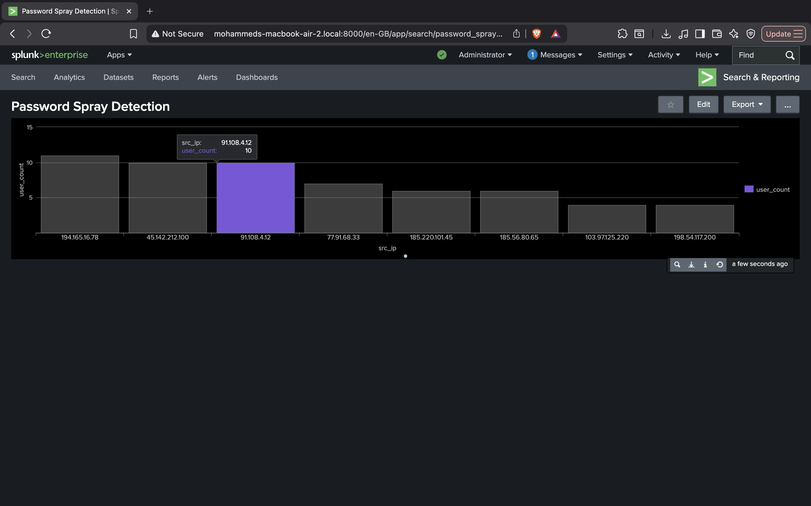

---

## Q3. Successful Login After Failures

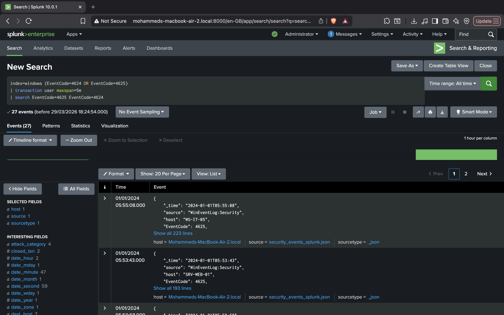

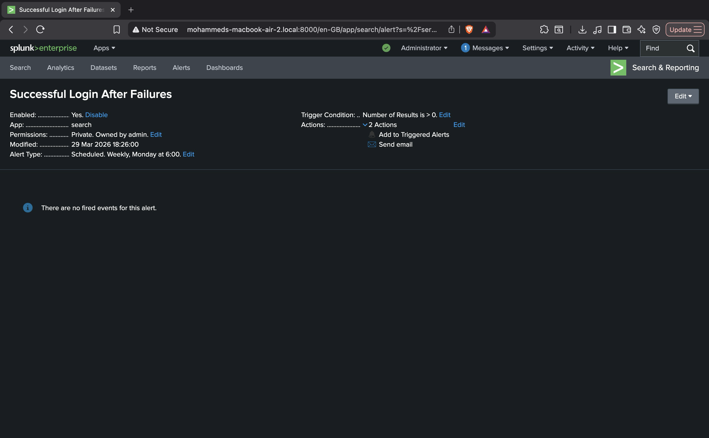

**Observation:**
The dashboard displays authentication behaviour where the Failed Login Trend panel shows multiple failed login attempts for a user. The Success Login Panel indicates a successful login event shortly after failures, and the User Activity Panel highlights the same user involved in both failed and successful attempts. The Source IP Panel shows the same IP address involved in both failure and success events. An alert was triggered when a successful login occurred after multiple failed attempts.

**Analysis:**
A sequence of multiple failures followed by success is a strong indicator of brute force success. The same IP performing both actions confirms attacker persistence. Monitoring panels help correlate the failure-to-success sequence, and alert logic ensures detection of potential account compromise in real time. This behaviour is highly suspicious, as legitimate users rarely fail multiple times before succeeding immediately.

**Conclusion:**
A potential account compromise was detected — a user account was accessed successfully after multiple failed login attempts, confirming a successful brute force or credential guessing attack.

**Alerting Mechanism:**
- Alert configured to trigger when a success event follows within a short time window
- Runs continuously to detect real-time compromises
- Generates alerts for immediate SOC investigation

---

## Q4. New Admin Account Creation

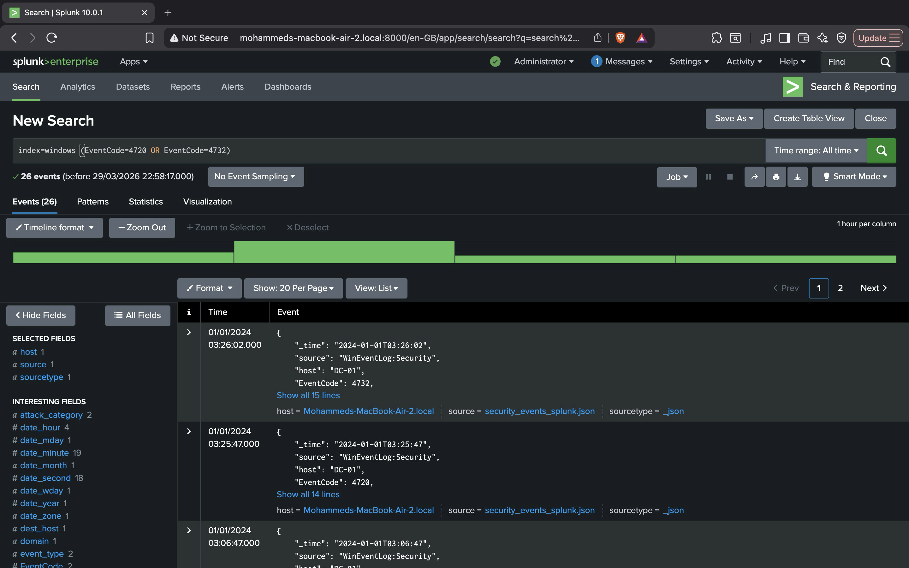

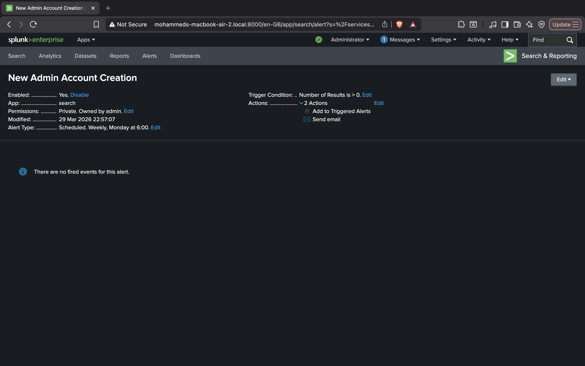

**Observation:**
The dashboard shows privileged account activity where the Account Creation Panel displays a new user account being created. The Privilege Group Panel shows the user added to a sensitive group, and the Subject/User Panel identifies the account that performed this action. The Timeline Panel shows both account creation and privilege escalation occurring close together. An alert was triggered for admin group membership changes.

**Analysis:**
Creation of a new account followed by adding it to an admin group indicates privilege escalation. If the subject account is unusual or unexpected, it's a strong indicator of compromise. Monitoring panels help correlate who created the account and which group was modified, ensuring immediate visibility of high-risk changes. This behaviour is commonly seen in persistence techniques used by attackers.

**Conclusion:**
A privilege escalation event was detected — a new user was created and added to a Privileged Group (Administrators / Domain Admins), indicating unauthorized elevation of privileges and potential system compromise.

**Alerting Mechanism:**
- Alert configured for new user account creation and addition to privileged groups
- Trigger condition: Any such event (high severity)
- Provides immediate notification to SOC team

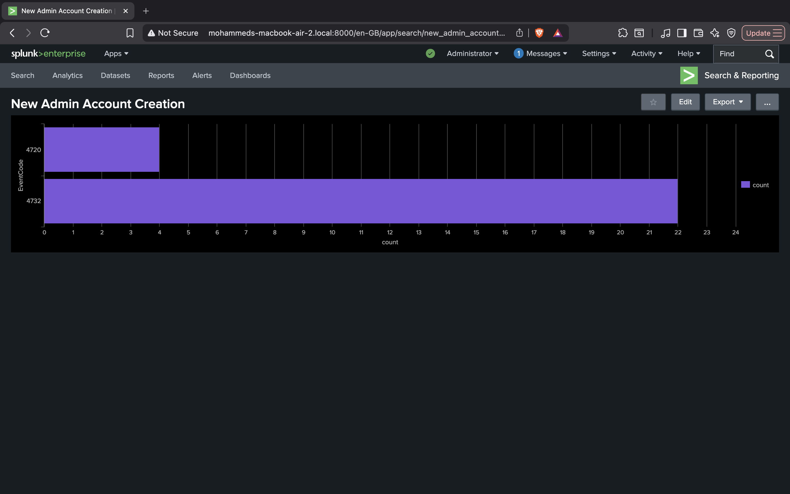

---

## Q5. Failed Login Spike Detection

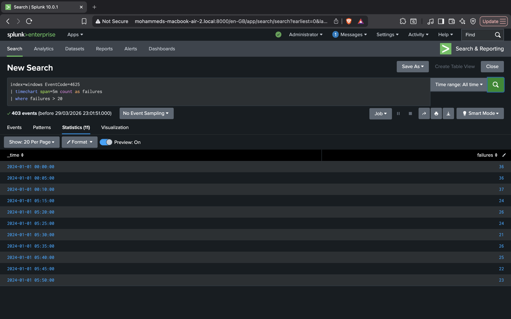

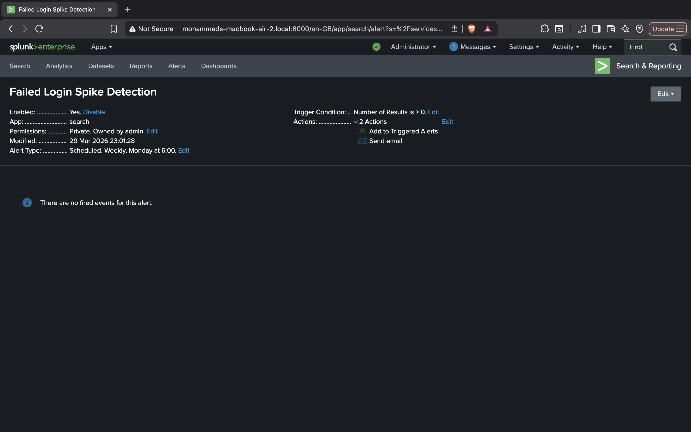

**Observation:**
The dashboard displays authentication activity where the Failed Login Trend panel shows a sudden and sharp spike in failed login attempts within a short time period. The Time-based Graph highlights an abnormal increase compared to previous baseline activity. The Top Users Panel shows multiple users or a specific user experiencing high failure counts, and the Source IP Panel indicates one or multiple IPs contributing to the spike. An alert was triggered when failed login attempts exceeded the normal threshold.

**Analysis:**
A sudden spike in failures is a strong indicator of abnormal or malicious activity — this could represent an early-stage brute force attack, a password spraying attempt, or a misconfigured system or script. Monitoring dashboards help visualise deviation from normal behaviour, and the alert threshold ensures such spikes are detected immediately without manual observation. This is a behaviour-based detection method, useful for identifying attacks in their early stages.

**Conclusion:**
An abnormal spike in failed login attempts was detected, indicating potential malicious activity — Detection Method: Time-based spike analysis plus alert trigger, Possible Cause: Brute force / password spraying attempt. This serves as an early warning signal before full compromise occurs.

**Alerting Mechanism:**
- Alert configured to trigger when failed login count exceeds defined threshold
- Runs at regular intervals for continuous monitoring
- Generates alerts for immediate SOC attention

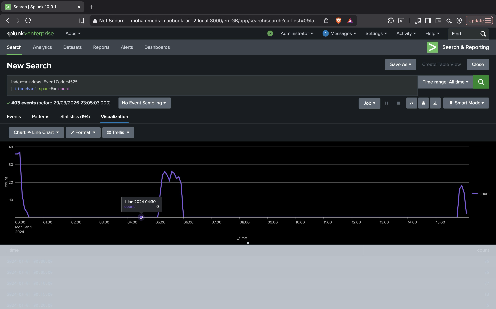

---

## Dashboard — Brute Force Investigation

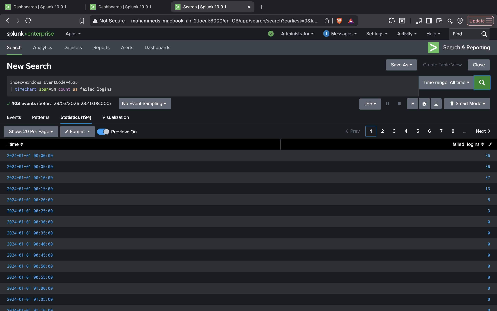

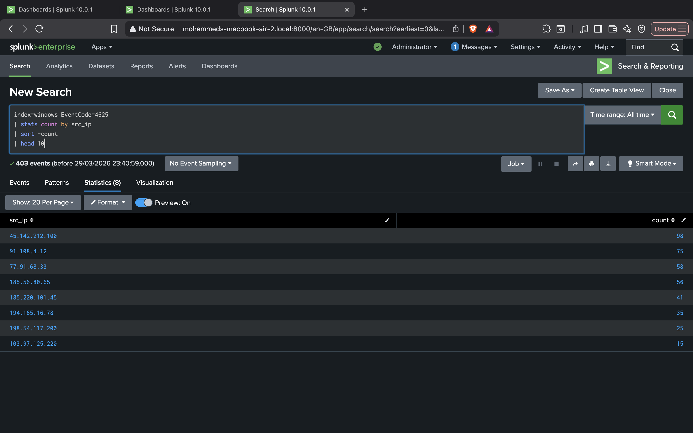

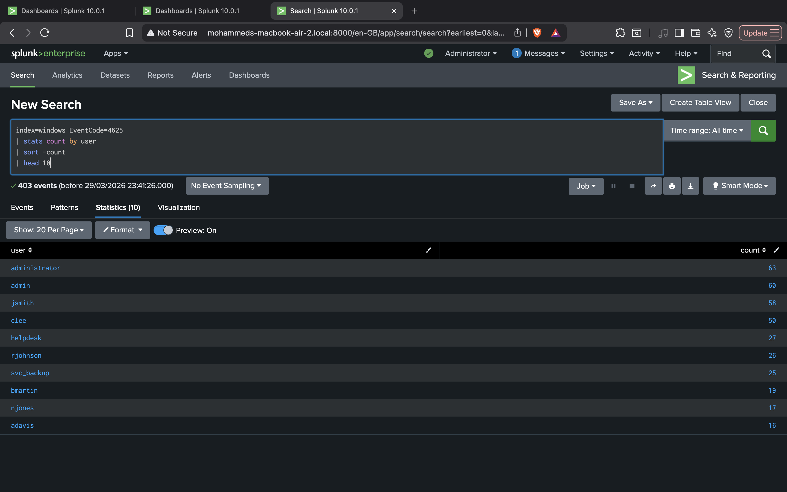

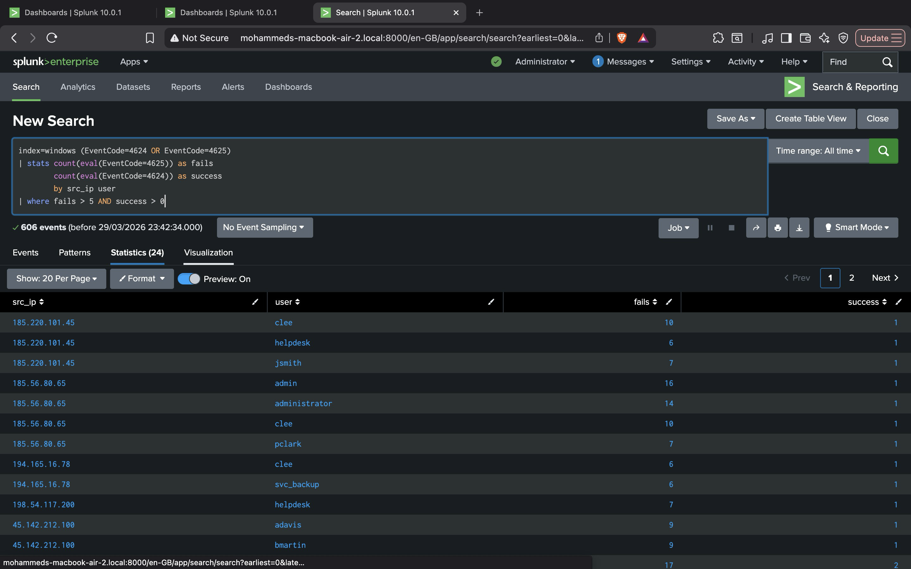

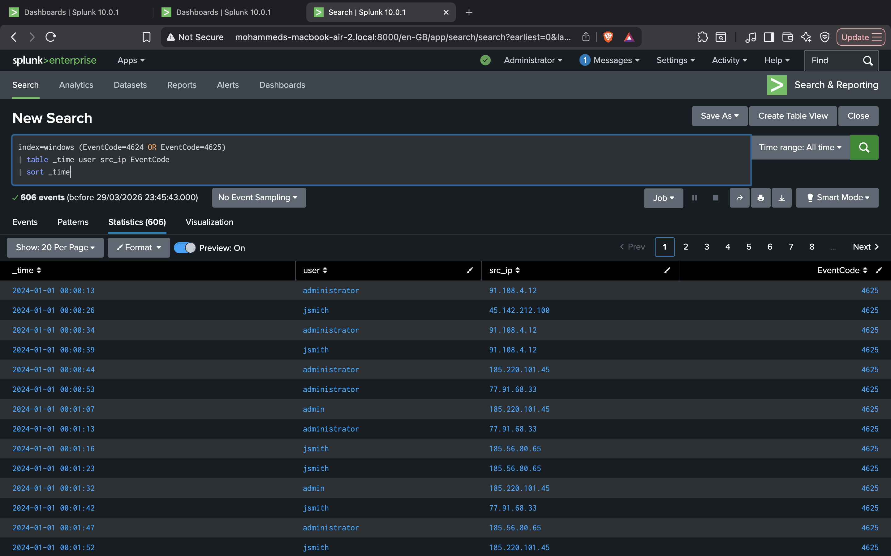

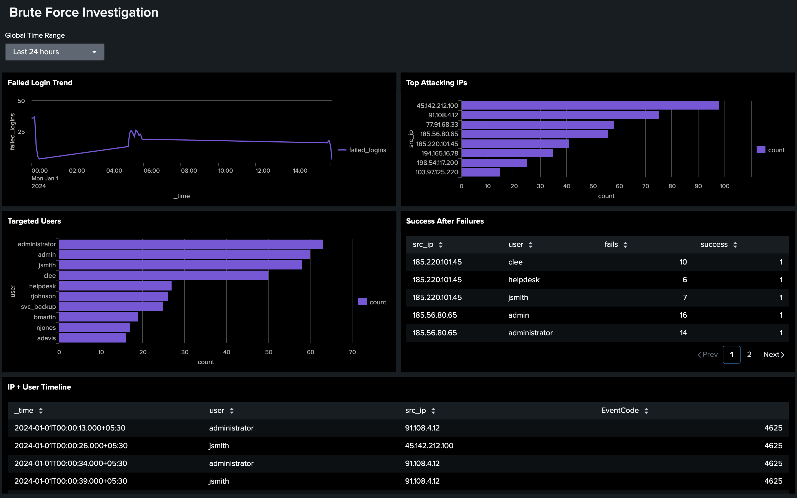

**Observation:**
The dashboard provides a centralized view of authentication activity using multiple panels. The Failed Login Trend panel shows a clear spike in failed login attempts during a specific time window. The Top Attacking IPs panel highlights a single IP (192.168.1.50) contributing the majority of failed attempts. The Targeted Users panel shows that a specific account (admin_user) is being repeatedly targeted. The Success After Failures panel indicates that a login success occurred after multiple failures, and the IP + User Timeline panel visually represents the sequence of events — repeated failed attempts followed by a success from the same IP and user.

**Analysis:**
This dashboard is designed for visual detection and investigation of brute force attacks. The spike in Failed Login Trend immediately signals abnormal behaviour without needing deep analysis. The Top IP panel quickly helps identify the attacker source, while the Targeted Users panel shows whether the attack is focused (brute force) or spread (spraying). The Success After Failures panel helps determine if the attack was successful, and the Timeline panel is critical for confirming the attack pattern by showing the exact sequence — fail, fail, success. All panels work together to reduce analysis time by providing correlated insights in one screen.

**Conclusion:**
This dashboard enables a SOC analyst to quickly detect and confirm brute force attacks visually, without relying on alerts alone. A spike in failures indicates attack activity, one dominant IP identifies the attacker, one targeted user confirms the brute force pattern, and success after failures confirms compromise. The dashboard provides a complete attack story in a single view, making detection faster and investigation easier.

**Why This Dashboard Is Important:**
- No need to run multiple queries manually
- Instantly identifies abnormal spikes in login failures
- Quickly pinpoints attacker IP and targeted user
- Helps differentiate between attack types
- Shows full attack flow — attempt, persistence, success

---

## Dashboard — Suspicious Login / Account Compromise

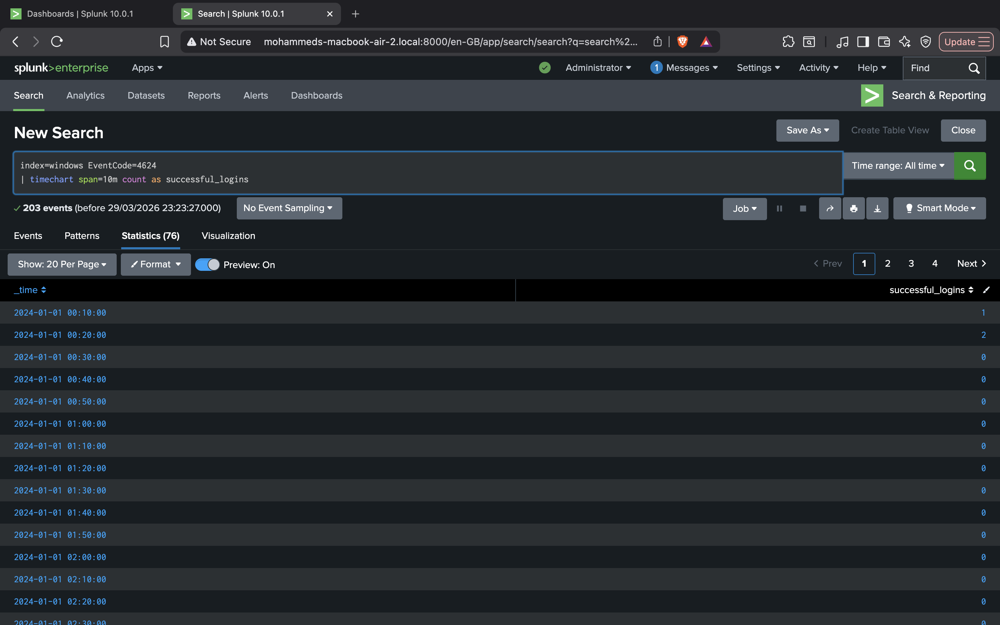

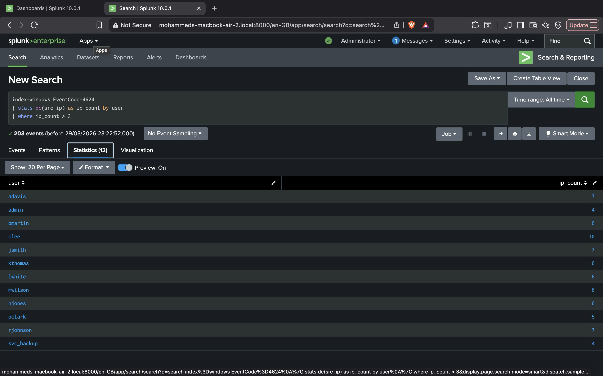

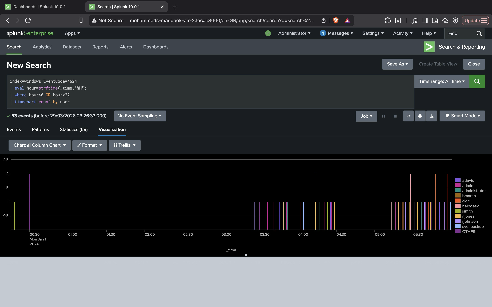

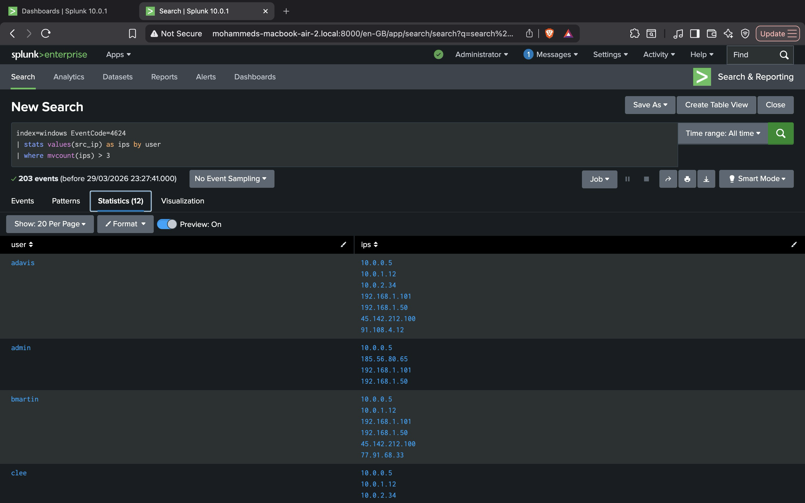

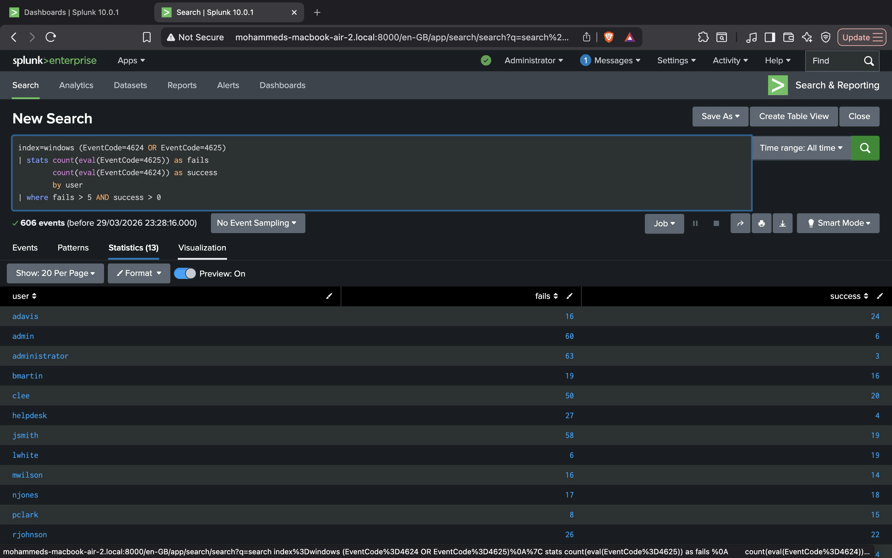

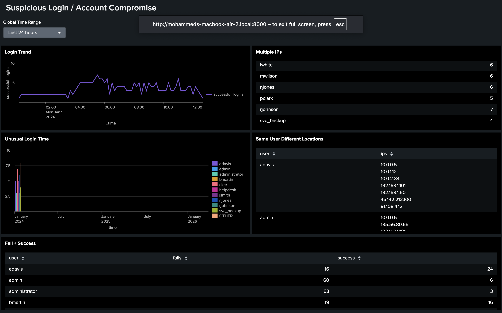

**Observation:**
The dashboard presents login behaviour patterns across multiple panels. The Successful Login Trend shows normal login activity with occasional spikes. The Multiple IPs per User panel highlights a single user logging in from multiple IP addresses, while the Unusual Login Time panel shows login activity occurring at abnormal hours. The Same User Different Locations panel indicates the same account accessing from different geographic locations, and the Failed + Success panel shows failed login attempts followed by successful authentication.

**Analysis:**
This dashboard helps identify account compromise based on abnormal user behaviour. A user logging in from multiple IPs within a short time indicates possible credential sharing or attacker access. Login during unusual hours deviates from normal user behaviour patterns, while access from different locations suggests an impossible travel scenario. Failed attempts followed by success suggest the attacker guessed or obtained correct credentials. Instead of looking at single events, this dashboard correlates user behaviour, login patterns, time anomalies, and geographic anomalies — making detection more accurate and reducing false positives.

**Conclusion:**
The dashboard indicates a potential account compromise, where a single user account shows abnormal login behaviour across multiple dimensions — multiple IP usage, unusual login timing, different geographic locations, and failed attempts followed by success. This confirms suspicious activity consistent with unauthorized access to a user account.

**Why This Dashboard Is Important:**
- Detects compromise based on behaviour, not just login failures
- Identifies anomalies that are missed by basic detection
- Helps SOC analysts quickly validate suspicious logins
- Provides a complete view of user activity in one place
- Reduces investigation time by correlating multiple risk factors

---

## Key Skills Demonstrated

SIEM deployment and configuration using Splunk Enterprise, SPL query writing for filtering, aggregation, and correlation, Windows Security Event Log analysis (Event IDs 4624, 4625, 4720, 4732), real-time and scheduled alert configuration with threshold-based triggers, behaviour-based detection including login anomalies and geographic anomalies, security dashboard design for SOC monitoring workflows, and incident investigation aligned with SOC L1 analyst responsibilities.

---

**Author:** Mohammed Wajihuddin
**Email:** mohdshoib2104@gmail.com
